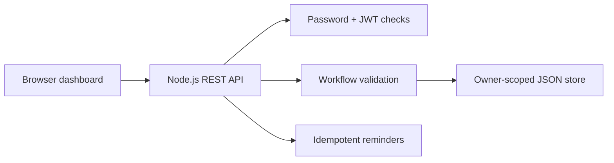

# Placement Tracker

A private job-application tracker for managing opportunities, stages, deadlines, and follow-ups. It is intentionally built with Node.js core APIs so the security and persistence behavior is visible rather than hidden behind frameworks.

## What it demonstrates

- REST API design with consistent JSON errors
- Password hashing with salted `scrypt`
- Signed and expiring HS256 JSON Web Tokens
- User-scoped CRUD that prevents cross-account access
- Validated application workflow transitions
- Search and status filters
- Editable notes, deadlines, follow-up dates, and per-stage schedule dates
- Idempotent follow-up reminder generation
- Atomic file persistence and serialized writes
- Responsive, accessible browser interface
- Integration tests against a real local HTTP server

## Run locally

Requirements: Node.js 22.18 or newer.

```bash
npm test
JWT_SECRET="replace-this-for-real-use" npm start
```

Open `http://127.0.0.1:3000`.

### Windows PowerShell

```powershell
npm test
$env:JWT_SECRET = "choose-a-long-random-value"
npm start
```

Then open `http://127.0.0.1:3000` in your browser.

Optional environment variables:

| Variable | Default | Purpose |
| --- | --- | --- |
| `PORT` | `3000` | HTTP port |
| `HOST` | `127.0.0.1` | Bind address |
| `DATA_FILE` | `data/placement-tracker.json` | Persistence file |
| `JWT_SECRET` | development-only value | Token signing secret; required in production |

## API summary

| Method | Route | Purpose |
| --- | --- | --- |
| POST | `/api/auth/register` | Create an account |
| POST | `/api/auth/login` | Sign in |
| GET/POST | `/api/applications` | Filter or create applications |
| GET/PATCH/DELETE | `/api/applications/:id` | Read, advance, or delete an owned application |
| POST | `/api/reminders/generate` | Create reminders that are due, without duplicates |
| GET | `/api/reminders` | List the signed-in user's reminders |

Authenticated routes require `Authorization: Bearer <token>`.

## Design decisions

The status transition table prevents applications from jumping forward or moving backward accidentally. Every store method accepts the authenticated user ID and filters before returning or modifying records. Reminder IDs combine the application ID and follow-up date, so running generation multiple times is safe.

The JSON store keeps local setup simple for an MVP. It serializes mutations and replaces the data file atomically, but it is not a substitute for a multi-instance database. A production evolution would move the same boundaries to PostgreSQL, add refresh tokens, and execute reminders through a durable job queue.

## Request flow



The dashboard uses a single form for create and edit operations. Existing applications can be rescheduled when deadlines or interview phases move, while owner checks remain enforced on every read and mutation.

## Two-minute browser check

1. Register with a throwaway local email and password.
2. Add an application with notes, deadline, follow-up date, and stage dates.
3. Confirm the notes and dates appear on its card.
4. Select **Edit**, change the dates and notes, and save.
5. Refresh the browser and confirm the changes persist.
6. Narrow the window to phone width and confirm the form and cards remain usable.

## Test

```bash
npm test
```

The 19-test suite covers workflow and schedule validation, password and JWT behavior, persistence and legacy-record migration, ownership, editing, search/filtering, reminder idempotency, asynchronous form submission, REST errors, and static-file traversal protection.
